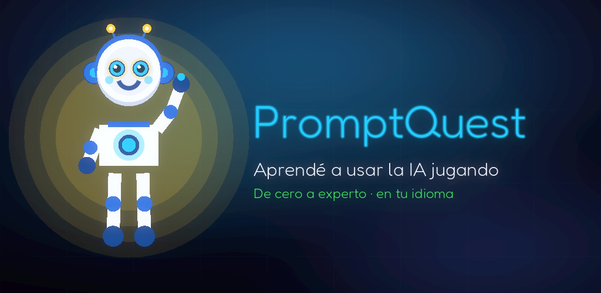
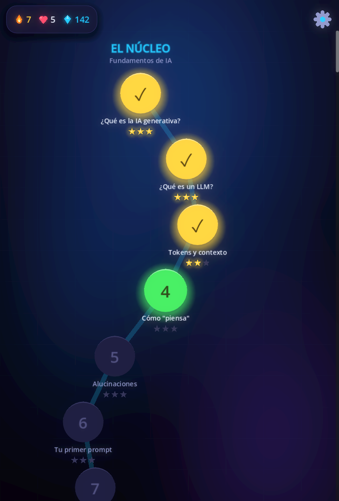
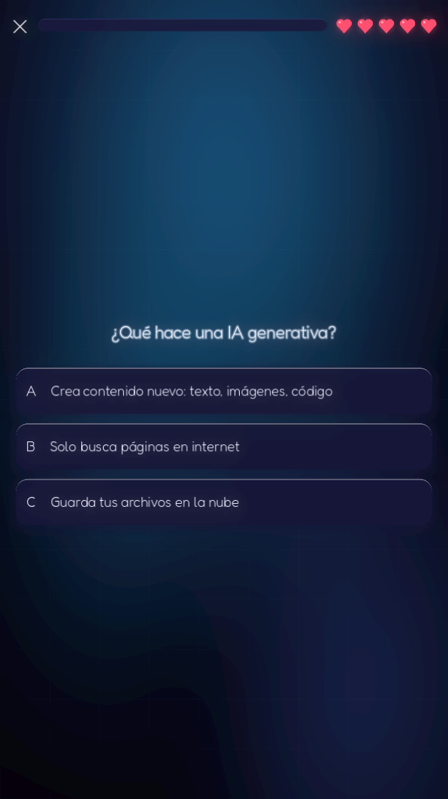
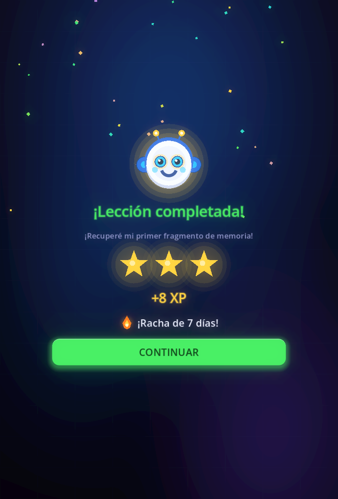
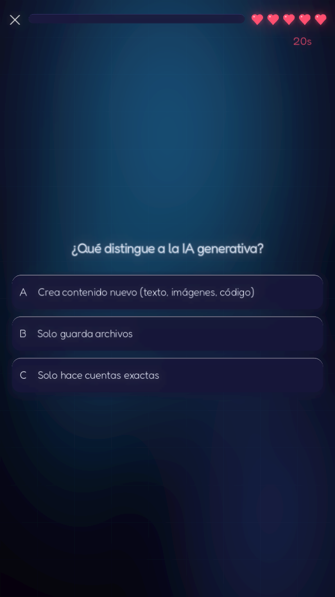
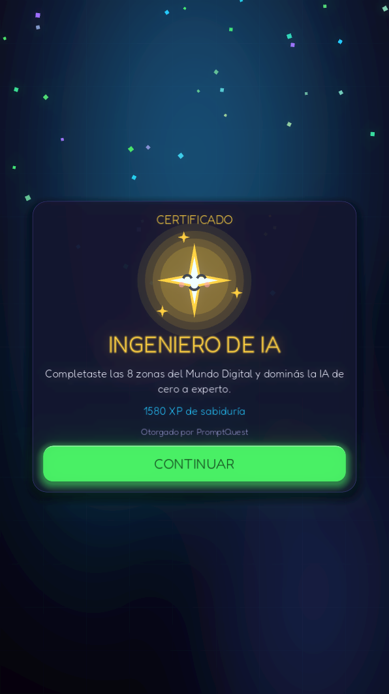

<div align="center">

# ✨ PromptQuest

### The free, open-source game that teaches you to use AI — from zero to AI engineer.
### El juego gratis y open source que te enseña a usar la IA — de cero a ingeniero.

**A Duolingo-style game for Artificial Intelligence. Built with [Claude Code](https://claude.com/claude-code).**




</div>

---

## 🎮 What is this?

**PromptQuest** is a 2D mobile game (Godot 4) that teaches you how to use generative AI —
the same addictive, bite-sized way Duolingo teaches languages. Instead of a language, you
learn **Artificial Intelligence**: what an LLM is, how to write great prompts, how models
compare, agents, RAG, prompt engineering, and how to build real AI workflows.

Meet **Chispa**, a little AI spark that lost its memory. Every lesson you complete gives a
fragment back — and by the end, **you can work with any AI like a pro.**

- 🗺️ **8 zones · 80 lessons** — a full path from *zero* to *AI engineer*
- 🌎 **Bilingual** — play in **Spanish or English**, switch anytime
- 📶 **100% offline** — no accounts, no data collection, no internet needed
- 🔥 Streaks, hearts, XP, stars, timed bosses, and a final **AI Engineer certification**
- 🆓 **Free forever** and **open source** (MIT)

<div align="center">

| The world map | A lesson | Rewards | The final boss | Certification |
|:---:|:---:|:---:|:---:|:---:|
|  |  |  |  |  |

</div>

## 🧠 The curriculum — 8 zones, zero → AI engineer

| # | Zone | You'll learn to... |
|---|------|--------------------|
| 1 | **The Core** | Understand AI, LLMs, tokens, context, hallucinations |
| 2 | **The Forge** | Prompt like a pro: step-by-step, iterate, templates |
| 3 | **The Workshop** | Use AI for writing, code, data, images, studying |
| 4 | **The Observatory** | Compare models (Claude, GPT, Gemini…) and choose well |
| 5 | **The Network** | APIs, agents, RAG, MCP — explained simply |
| 6 | **The Crucible** | Advanced prompt engineering, safety, evaluation |
| 7 | **The Factory** | Put AI into real workflows |
| 8 | **The Summit** | Senior-level AI engineering + a final capstone |

Full breakdown: [`docs/curriculum-completo.md`](docs/curriculum-completo.md).

## 🤖 Built entirely with Claude Code

This whole game — engine architecture, 80 bilingual lessons, the art (drawn in code, no
external image assets), the tests, and the store assets — was **designed and built in
collaboration with [Claude Code](https://claude.com/claude-code)**. The planning docs are
public too, in [`docs/`](docs/), if you're curious how an AI helped ship a game about AI. 🤯

## ▶️ Play / Run it

You need **[Godot 4.6](https://godotengine.org/download)** (no other dependencies).

```bash
# Open the project in Godot, or from a terminal:
bash tools/run.sh      # launch the game in a window
bash tools/test.sh     # run the headless test suite (53 tests)
```

Everything is code-drawn and self-contained — the whole app is tiny.

## 🤝 Contribute — adding a lesson takes 5 minutes

Content lives in plain **JSON**, separate from the code. Adding or fixing a lesson doesn't
require touching a single line of game logic. See [`CONTRIBUTING.md`](CONTRIBUTING.md).

```
content/unit3/lesson_04.json   ← a lesson is just this file
```

Translations, new lessons, bug fixes, and new exercise types are all welcome. 💜

## 📦 Ship it to the Play Store

The game is store-ready. Step-by-step guide (SDK, keystore, listing, data safety):
[`docs/publicacion-play-store.md`](docs/publicacion-play-store.md). Store copy in ES/EN:
[`store/ficha-tienda.md`](store/ficha-tienda.md).

## 🛠️ Tech

- **Godot 4.6** (GDScript), 2D, Mobile renderer, exports to Android
- Rendered at 1080p with 2D anti-aliasing; responsive on any phone (`keep_width`)
- All art (mascot, icons, backgrounds) is **drawn in code** — no image assets, no bloat
- Own headless test harness (53 tests), content validator, screenshot tooling

## 📜 License & credits

- **Code & content:** [MIT](LICENSE) — free to use, modify and share.
- **Font:** [Fredoka](https://fonts.google.com/specimen/Fredoka) — SIL Open Font License ([`assets/fonts/OFL.txt`](assets/fonts/OFL.txt)).
- **Built by** [@andresmarkic](https://github.com/andresmarkic) with 🤖 Claude Code, from Argentina 🇦🇷.

---

<div align="center">

**If PromptQuest helped you, drop a ⭐ — it genuinely helps others find it.**

*Aprender a usar la IA debería ser gratis y divertido. / Learning to use AI should be free and fun.*

</div>
